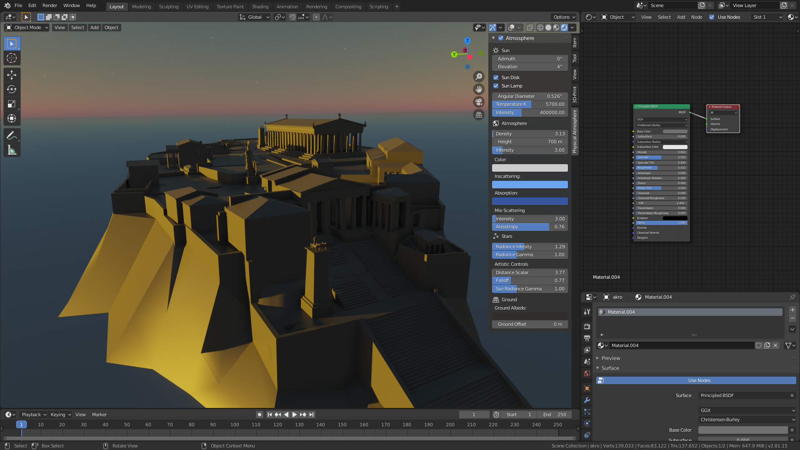
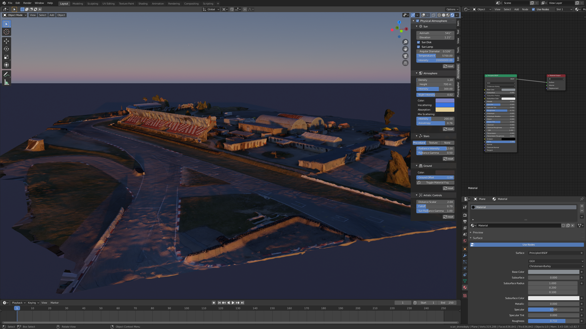

### How to add Fog?

The "SkylightAtmosphere" is a universal node, it also works on object materials. All you need to do is to add the node group in your Object Shader Node tree just before the Material Output.

***NOTE: right now adding the fog to your materials is completely manual. In next releases I'll automate the process of adding and removing the fog.***

Here is how:

- Select your object and material you would like to add the fog to. Open the Shader Node Editor.

- Select Add/Group/StarlightAtmosphere and insert just before Material Output of your shader, like shown in the image. It will connect the "sockets" automatically.

- Now you have fog! Change the Atmosphere parameters to see the immediate results.

- "Atmosphere Density", "Distance Scalar" and "Falloff" has the most apparent impact on the fog.

